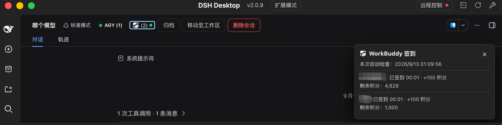

# DSH Buddy Check-in

DSH 启动时自动为 WorkBuddy 国内版账号完成每日签到：扫描本机登录过的全部国内版账号，逐个领取每日积分并汇报结果；打开详情卡片时会重新查询余额，不用再记得打开 App 点签到。



## 功能

- **开箱即用**：装好即生效，DSH 启动时自动签到，无需配置；当天已签过的账号（含在 App 内手动签过的）自动跳过，多次重启不重复请求。
- **深浅主题自适应**：图标与面板颜色跟随 DSH 外观。
- **多账号自动发现**：读取 WorkBuddy 桌面 App 的共享登录目录，App 每次登录、切号都会留下带时间戳的凭据备份，**在本机登录过的国内版账号都会被找到**，按账号去重、各取最新一份凭据。
- **会话标题行入口**：标题行显示 WorkBuddy 图标、账号数和状态点（绿色全部已签，黄色部分失败、下次启动自动重试，红色全部失败）；没有国内版账号时不显示。
- **详情面板**：点击入口查看每个账号的签到结果、签到时间、到账积分与最新剩余积分；每次打开都会重新查询余额，账号很多时列表限高滚动。
- **重试失败账号**：面板一键只重试当天失败的账号，不动已成功的。
- **启动汇总**：当天首次出结果时弹一次简短汇总（如「WorkBuddy 已完成今日签到：2 个账号」），同日后续启动不再打扰。

## 安装

前置：本机安装并登录过 WorkBuddy 桌面 App（国内版）；DSH `0.1.5-rc.1` 及以上。

```sh
# npm（推荐）
dsh plugin --profile web add dsh-buddy-checkin

# 或 GitHub
dsh plugin --profile web add github:corrinehu/dsh-buddy-checkin

# 或本地开发（链接到本仓库，改完 pnpm run check 构建后重启 dsh 即生效）
dsh plugin --profile web add <本仓库路径>
```

安装后启动 `dsh web`（或重启 Desktop）。在 macOS 与 Windows 的 DSH Web 与 Desktop 下验证通过。

## 已知限制

- **仅国内版**：国际版账号无签到入口（国际 token 调国内端点返回 401），相关文件已按文件名排除。
- **TUI 未适配**：客户端界面为浏览器形态，仅在 Web 与 Desktop 下提供。
- **不开 DSH 的日子不签到**：v1 不做定时器/cron，签到只在 DSH 启动时发生；上游接口仅支持签当天，错过的天数无法补签，该日积分自然错过，次日启动正常签次日。
- 不做账号管理与凭据续期；也不提供对已成功账号的手动重复签到。
- 依赖 WorkBuddy 客户端接口（非官方开放 API），WorkBuddy 更新后插件可能需要随之调整。
- **加密凭据**：兼容 WorkBuddy 5.6+ 的加密授权文件（自动借用本机 WorkBuddy App 的 Electron 获取解密密钥，密钥仅在内存中使用，不落盘、不外传）；旧版明文凭据同样支持，同一账号新旧文件并存时取最新可用的一份。
- **Windows / Linux 读加密凭据**：需用 `WORKBUDDY_ELECTRON_BIN` 指定 WorkBuddy 的 Electron 二进制路径（明文凭据不受影响）。
- **重装 App 后的旧备份**：由旧密钥加密的历史备份无法解开，对应账号会在面板显示失败并提示重新登录；在 App 里重新登录该账号即可恢复。

## 免责声明

- 本项目**仅供个人学习和研究使用**，仅驱动使用者自己的 WorkBuddy 账号在本机调用，请勿用于商业用途或超出个人合理使用的场景。
- 使用者需遵守 WorkBuddy 的服务条款；因使用本项目产生的任何后果（包括但不限于账号被限制、额度被清空、服务中断），由使用者自行承担。
- 本项目作者不对任何因使用或滥用本项目产生的直接或间接损失负责。
- 本项目与腾讯、WorkBuddy、DeepSeek 均无关联，未获其授权或认可；文中出现的名称仅用于描述兼容关系，其商标权利归各自所有。

## 许可证

[MIT](./LICENSE)
